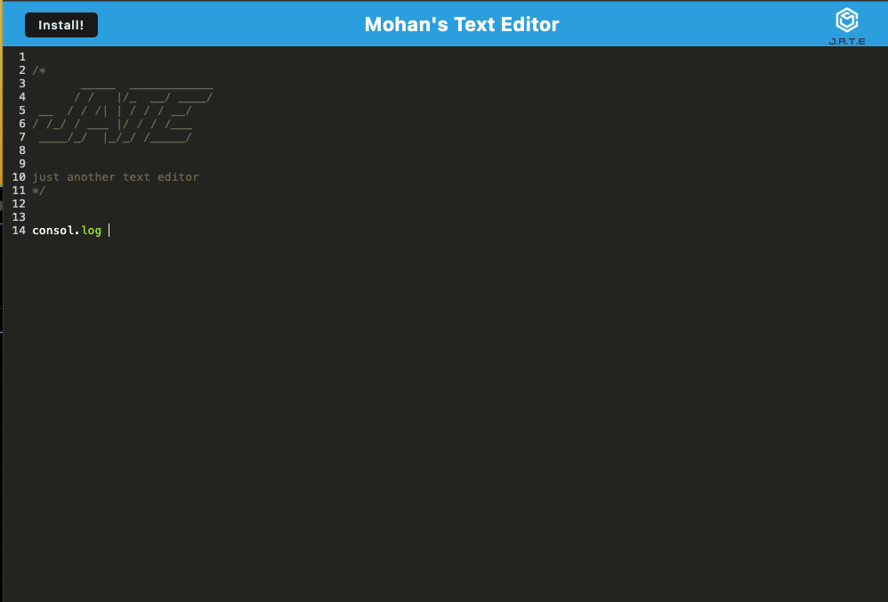

# PWA Code & Text Editor

## Overview

The PWD text editor is a text editor that runs in the browser. The app is a single-page application that meets the PWA criteria. Additionally, it features a number of data persistence techniques that serve as redundancy in case one of the options is not supported by the browser. The application will also function offline.

## User Story
AS A developer 
I WANT to create notes or code snippets with or without an internet connection
SO THAT I can reliably retrieve them for later use

## Acceptance Criteria
GIVEN a text editor web application
WHEN I open my application in my editor
THEN I should see a client server folder structure
WHEN I run `npm run start` from the root directory
THEN I find that my application should start up the backend and serve the client
WHEN I run the text editor application from my terminal
THEN I find that my JavaScript files have been bundled using webpack
WHEN I run my webpack plugins
THEN I find that I have a generated HTML file, service worker, and a manifest file
WHEN I use next-gen JavaScript in my application
THEN I find that the text editor still functions in the browser without errors
WHEN I open the text editor
THEN I find that IndexedDB has immediately created a database storage
WHEN I enter content and subsequently click off of the DOM window
THEN I find that the content in the text editor has been saved with IndexedDB
WHEN I reopen the text editor after closing it
THEN I find that the content in the text editor has been retrieved from our IndexedDB
WHEN I click on the Install button
THEN I download my web application as an icon on my desktop
WHEN I load my web application
THEN I should have a registered service worker using workbox
WHEN I register a service worker
THEN I should have my static assets pre cached upon loading along with subsequent pages and static assets
WHEN I deploy to Heroku
THEN I should have proper build scripts for a webpack application

## Technologies Used

- Node.js
- Webpack
- HTML / CSS / Javascript

## Usage Guide

1. Launch Text Editor.
2. Begin typing your notes or code snippets.
3. When done, simply navigate away; it will automatically saves your content.
4. To install the text editor on your desktop, click the `"Install"` button.
5. To retrieve saved content, just reopen the application.

## Live Demo

Check out the live version of this project [here](https://notetakermohan-5211fd8ac401.herokuapp.com/).

## Screenshots

The following image shows the web application's appearance:

## Github link
https://github.com/mohanbeckford/text-editor

